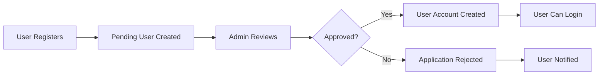

# Authentication & User Management Guide

## 🔐 Authentication Flow

### 1. How Authentication Works
Your app uses a hybrid approach:
- **Supabase Auth**: For production users with email verification
- **Demo Mode**: For testing without Supabase setup
- **Pending Users**: Registration approval workflow

### 2. User Registration Process
```
User fills form → Creates pending_user → Admin reviews → Approved user moved to users table → User can login
```

## 👥 User Roles & Permissions

### Role Hierarchy
1. **Admin**: Full platform access
2. **Support**: Customer service functions
3. **Wholesaler**: Sell products, manage orders
4. **Retailer**: Buy products, place orders

### Permission Matrix
| Feature | Admin | Support | Wholesaler | Retailer |
|---------|-------|---------|------------|----------|
| Manage Users | ✅ | ❌ | ❌ | ❌ |
| Approve Registrations | ✅ | ❌ | ❌ | ❌ |
| View All Orders | ✅ | ✅ | Own Only | Own Only |
| Manage Products | ✅ | ❌ | Own Only | ❌ |
| Create Promotions | ✅ | ❌ | ✅ | ❌ |
| Handle Support | ✅ | ✅ | ❌ | Create Only |
| Process Returns | ✅ | ✅ | ❌ | Request Only |

## 🔧 Setting Up Authentication

### 1. Supabase Auth Configuration

**In Supabase Dashboard > Authentication > Settings:**

```
Site URL: https://your-domain.com
Additional Redirect URLs:
- http://localhost:5173 (for development)
- https://your-domain.com/auth/callback
- https://your-domain.com/dashboard

Email Confirmation: Enabled
Email Double Confirmation: Disabled
Enable Manual Linking: Disabled
```

### 2. Email Templates

**Confirm Signup Template:**
```html
<h2>Welcome to NWI B2B Platform!</h2>
<p>Hi {{ .Name }},</p>
<p>Thank you for signing up to the NWI B2B Platform. Please confirm your email address by clicking the link below:</p>
<p><a href="{{ .ConfirmationURL }}">Confirm your email</a></p>
<p>If you didn't create an account, you can safely ignore this email.</p>
<p>Best regards,<br>The NWI B2B Team</p>
```

**Reset Password Template:**
```html
<h2>Reset Your Password</h2>
<p>Hi {{ .Name }},</p>
<p>Someone requested a password reset for your NWI B2B Platform account.</p>
<p><a href="{{ .ConfirmationURL }}">Reset your password</a></p>
<p>If you didn't request this, you can safely ignore this email.</p>
<p>Best regards,<br>The NWI B2B Team</p>
```

## 👤 User Management Operations

### 1. Approving Pending Users

**Through the App (Recommended):**
1. Login as admin
2. Go to "Applications" tab
3. Review user details
4. Click "Approve" or "Reject"

**Through SQL:**
```sql
-- Approve a pending user
DO $$
DECLARE
  pending_user_record pending_users%ROWTYPE;
BEGIN
  -- Get pending user data
  SELECT * INTO pending_user_record 
  FROM pending_users 
  WHERE id = 'pending-user-id';
  
  -- Create new user
  INSERT INTO users (
    name, email, role, business_name, phone, address, verified, status
  ) VALUES (
    pending_user_record.name,
    pending_user_record.email,
    pending_user_record.role,
    pending_user_record.business_name,
    pending_user_record.phone,
    pending_user_record.address,
    true,
    'active'
  );
  
  -- Update pending user status
  UPDATE pending_users 
  SET status = 'approved', 
      reviewed_at = now(), 
      reviewed_by = auth.uid()
  WHERE id = 'pending-user-id';
END $$;
```

### 2. Managing User Status
```sql
-- Suspend a user
UPDATE users 
SET status = 'suspended', updated_at = now()
WHERE id = 'user-id';

-- Reactivate a user
UPDATE users 
SET status = 'active', updated_at = now()
WHERE id = 'user-id';

-- Verify a user
UPDATE users 
SET verified = true, updated_at = now()
WHERE id = 'user-id';
```

### 3. Role Changes
```sql
-- Promote retailer to wholesaler (careful!)
UPDATE users 
SET role = 'wholesaler', updated_at = now()
WHERE id = 'user-id' AND role = 'retailer';

-- Add support role
UPDATE users 
SET role = 'support', updated_at = now()
WHERE id = 'user-id';
```

## 🔒 Security Policies Deep Dive

### 1. Understanding RLS Policies

**Policy Structure:**
```sql
CREATE POLICY "policy_name" ON table_name
  FOR operation -- SELECT, INSERT, UPDATE, DELETE, ALL
  TO role -- authenticated, anon, public
  USING (condition) -- Row visibility condition
  WITH CHECK (condition); -- Row modification condition
```

### 2. Key Policies in Your App

**Users Table:**
```sql
-- Users can read their own profile
CREATE POLICY "Users can read own profile" ON users
  FOR SELECT TO authenticated
  USING (auth.uid() = id);

-- Admins can manage all users
CREATE POLICY "Admins have full access to users" ON users
  FOR ALL TO authenticated
  USING (EXISTS (
    SELECT 1 FROM users 
    WHERE id = auth.uid() AND role = 'admin'
  ));
```

**Products Table:**
```sql
-- Anyone can view available products
CREATE POLICY "Anyone can view available products" ON products
  FOR SELECT TO public
  USING (available = true);

-- Wholesalers can manage their products
CREATE POLICY "Wholesalers can manage their products" ON products
  FOR ALL TO authenticated
  USING (
    wholesaler_id = auth.uid() OR 
    EXISTS (
      SELECT 1 FROM users 
      WHERE id = auth.uid() AND role IN ('admin', 'support')
    )
  );
```

**Orders Table:**
```sql
-- Users can view their orders
CREATE POLICY "Users can view their orders" ON orders
  FOR SELECT TO authenticated
  USING (
    retailer_id = auth.uid() OR 
    wholesaler_id = auth.uid() OR 
    EXISTS (
      SELECT 1 FROM users 
      WHERE id = auth.uid() AND role IN ('admin', 'support')
    )
  );

-- Retailers can create orders
CREATE POLICY "Retailers can create orders" ON orders
  FOR INSERT TO authenticated
  WITH CHECK (
    retailer_id = auth.uid() AND 
    EXISTS (
      SELECT 1 FROM users 
      WHERE id = auth.uid() AND role = 'retailer'
    )
  );
```

### 3. Testing Policies
```sql
-- Test as specific user
SELECT set_config('request.jwt.claims', '{"sub": "user-id-here"}', true);

-- Test what they can see
SELECT * FROM products; -- Should only show allowed products
SELECT * FROM orders;   -- Should only show their orders

-- Reset to admin
SELECT set_config('request.jwt.claims', '{"sub": "admin-user-id"}', true);
```

## 📱 Session Management

### 1. Session Persistence
Your app automatically:
- Saves user sessions to localStorage
- Restores sessions on app reload
- Handles session expiration gracefully

### 2. Session Configuration
```typescript
// In your app context
const checkAuthState = async () => {
  // Check Supabase session
  const { data: { session } } = await supabase.auth.getSession();
  
  if (session?.user) {
    // Load user profile from database
    const profile = await AuthService.getUserProfile(session.user.id);
    if (profile) {
      dispatch({ type: 'SET_USER', payload: profile });
    }
  } else {
    // Check localStorage for demo users
    const savedUser = LocalStorageService.getUserSession();
    if (savedUser) {
      dispatch({ type: 'SET_USER', payload: savedUser });
    }
  }
};
```

### 3. Logout Handling
```typescript
const handleLogout = async () => {
  try {
    // Sign out from Supabase
    await supabase.auth.signOut();
    
    // Clear local storage
    LocalStorageService.clearUserSession();
    LocalStorageService.clearCartData();
    
    // Update app state
    dispatch({ type: 'SET_USER', payload: null });
  } catch (error) {
    console.error('Logout error:', error);
    // Force logout even if Supabase fails
    dispatch({ type: 'SET_USER', payload: null });
  }
};
```

## 🛡️ Security Best Practices

### 1. Password Requirements
- Minimum 6 characters
- Email verification required
- Password reset functionality

### 2. Account Security
```sql
-- Monitor failed login attempts
SELECT 
  email,
  COUNT(*) as failed_attempts,
  MAX(created_at) as last_attempt
FROM auth.audit_log_entries 
WHERE event_type = 'user_signedin_failed'
  AND created_at > now() - interval '1 hour'
GROUP BY email
HAVING COUNT(*) > 5;
```

### 3. Data Protection
- All sensitive data encrypted at rest
- API keys never exposed in frontend
- RLS prevents unauthorized data access
- Regular security audits recommended

## 🔄 User Lifecycle Management

### 1. Registration → Approval → Active


### 2. Automated Workflows
Your app includes automated processes:
- Email notifications for status changes
- Real-time updates across all connected users
- Automatic cart persistence
- Session management

### 3. User Status Management
```sql
-- View user status distribution
SELECT 
  role,
  status,
  COUNT(*) as count
FROM users 
GROUP BY role, status
ORDER BY role, status;

-- Find inactive users
SELECT *
FROM users 
WHERE status = 'active' 
  AND id NOT IN (
    SELECT DISTINCT retailer_id 
    FROM orders 
    WHERE created_at > now() - interval '30 days'
  );
```

This authentication system provides secure, scalable user management with proper role-based access control and real-time capabilities.